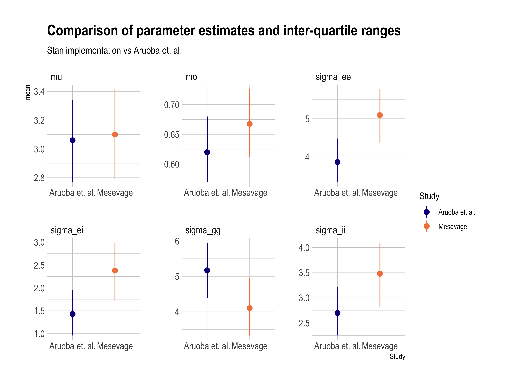
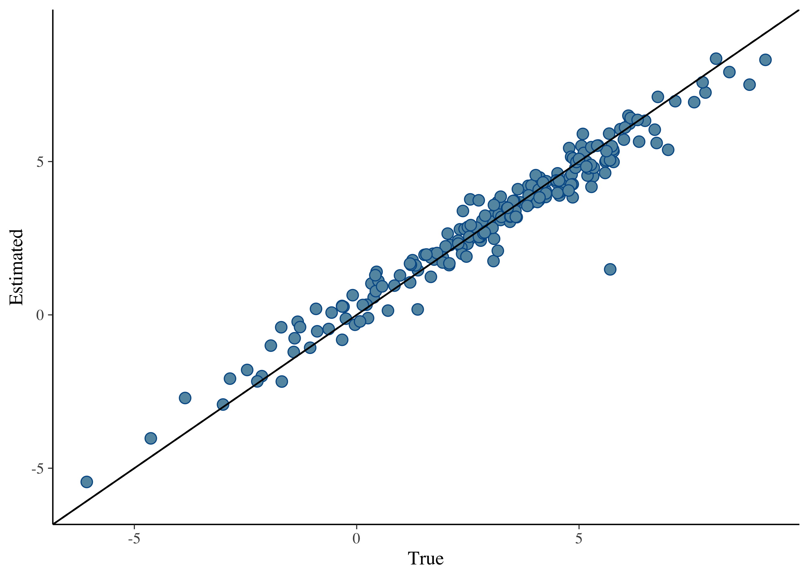
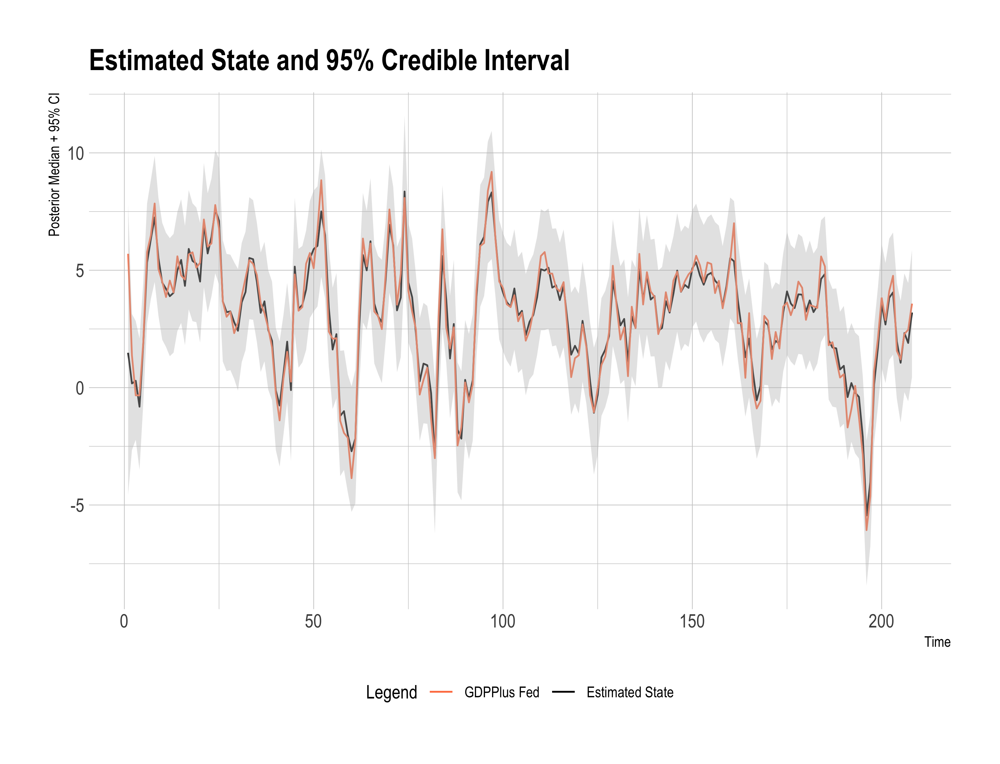

<!-- README.md is generated from README.Rmd. Please edit that file -->

# state_space_gdp: Using Bayesian State Space Models to Reconcile Historical GDP Estimates

<!-- badges: start -->
<!-- badges: end -->

The object of this exercise is to try to reconcile historical GDP
estimates by optimally combining them using state space models.

Given a series of measures of GDP such as
,
,
and
,
for the income, expenditure, and output approaches to measuring GDP, we
might like to optimally combine them to get a series

that reflects the measurement efforts of multiple scholars. Many
attempts to combine GDP measurements exist, and here we follow the
approach of Aruoba et. al. as they designed the state-space estimator
for GDPPlus as implemented by the Philadelphia Federal Reserve.

We stack our GDP measures into a vector

measured over time periods

to
.
We assume that our measurements of GDP are generated by true GDP, but
are corrupted by noise:

![Y_t = \[1, 1, 1\]' x_t + \\epsilon_t.](https://latex.codecogs.com/png.image?%5Cdpi%7B110%7D&space;%5Cbg_white&space;Y_t%20%3D%20%5B1%2C%201%2C%201%5D%27%20x_t%20%2B%20%5Cepsilon_t. "Y_t = [1, 1, 1]' x_t + \epsilon_t.")

True GDP itself is latent but moves autoregressively:

 + \rho x_{t-1} + \eta_t.")

An important consideration is the covariance structure of our
measurements of GDP. It is reasonable to think that they are likely to
be correlated, thus we model the covariance of our system as
block-diagonal in the signals, so that the 4

4 matrix

has zeros in rows 2:4 of column 1, and in columns 2:4 of row 1.


We are unfortunately constrained initially to a block-diagonal
formulation so that the system remains identifiable. Aruoba et.
al. suggest two approaches to relaxing this assumption which I will try
to incorporate later.

As a result of this formulation, we need to estimate 9 parameters:
,
,
the 4 diagonal variance terms
,
and the off-diagonal variance terms in the lower or upper triangle of
.

The model is implemented in Stan. I test the implementation against the
`GDPPlus` model which provides published inputs and outputs. It computes
GDPPlus using two methods of measuring GDP: Income and Production. I
pick priors that match the discussion in the Aruoba et. al. paper.

First, we need to load Stan and some associated libraries, load the
data, format it for our program and compile the stan model.

``` r
library(readxl)
library(tidyverse)
library(tidybayes)
library(cmdstanr)
library(bayesplot)

## helper function to format data
source("code/format_data.R")

## compile model
ss_block_diagonal <- cmdstan_model("code/ss_block_diagonal.stan", include_paths = ".")

df <- read_xlsx("data/gdpplus.xlsx")
df %>% dim()
#> [1] 240   7

y_mat <- df %>% filter(OBS_YEAR < 2012) %>% select(GRGDP_DATA, GRGDI_DATA)

data <- format_data(y_mat)
```

Now we are in a position to sample from the model. I draw 2000 samples
with 1000 warm-up samples across 4 parallel chains. The model samples
quickly and this should take under a minute.

``` r
## Fitting the model

fit_stan_gdp <- ss_block_diagonal$sample(data = data, 
                                         parallel_chains = 4, 
                                         iter_sampling = 2000, 
                                         show_messages = F, refresh = 1000)
#> Running MCMC with 4 parallel chains...
#> 
#> Chain 1 Iteration:    1 / 3000 [  0%]  (Warmup) 
#> Chain 2 Iteration:    1 / 3000 [  0%]  (Warmup) 
#> Chain 3 Iteration:    1 / 3000 [  0%]  (Warmup) 
#> Chain 4 Iteration:    1 / 3000 [  0%]  (Warmup) 
#> Chain 4 Iteration: 1000 / 3000 [ 33%]  (Warmup) 
#> Chain 4 Iteration: 1001 / 3000 [ 33%]  (Sampling) 
#> Chain 3 Iteration: 1000 / 3000 [ 33%]  (Warmup) 
#> Chain 3 Iteration: 1001 / 3000 [ 33%]  (Sampling) 
#> Chain 2 Iteration: 1000 / 3000 [ 33%]  (Warmup) 
#> Chain 2 Iteration: 1001 / 3000 [ 33%]  (Sampling) 
#> Chain 1 Iteration: 1000 / 3000 [ 33%]  (Warmup) 
#> Chain 1 Iteration: 1001 / 3000 [ 33%]  (Sampling) 
#> Chain 4 Iteration: 2000 / 3000 [ 66%]  (Sampling) 
#> Chain 3 Iteration: 2000 / 3000 [ 66%]  (Sampling) 
#> Chain 2 Iteration: 2000 / 3000 [ 66%]  (Sampling) 
#> Chain 1 Iteration: 2000 / 3000 [ 66%]  (Sampling) 
#> Chain 4 Iteration: 3000 / 3000 [100%]  (Sampling) 
#> Chain 4 finished in 24.1 seconds.
#> Chain 3 Iteration: 3000 / 3000 [100%]  (Sampling) 
#> Chain 3 finished in 24.8 seconds.
#> Chain 2 Iteration: 3000 / 3000 [100%]  (Sampling) 
#> Chain 2 finished in 25.2 seconds.
#> Chain 1 Iteration: 3000 / 3000 [100%]  (Sampling) 
#> Chain 1 finished in 25.6 seconds.
#> 
#> All 4 chains finished successfully.
#> Mean chain execution time: 24.9 seconds.
#> Total execution time: 25.8 seconds.


# check against their point estimates
aruoba <- tibble(mean = c(3.06, .62, 5.17, 
                          3.86, 1.43, 2.7),
                 `25%` = c(2.77, .57, 4.39,
                           3.34, .96, 2.25),
                 `75%` = c(3.34, .68, 5.95,
                           4.48, 1.95, 3.22),
                 Study = "Aruoba et. al.",
                 params = c("mu", "rho", "sigma_gg", 
                            "sigma_ee", "sigma_ei", "sigma_ii"))

param_comp <- fit_stan_gdp$summary(variables = c("gamma", "theta", "sigma_state", "Sigma"),
                     mean, ~quantile(.x, c(.25, .75))) %>% 
  filter(variable != "Sigma[1,2]") %>% 
  mutate(Study = "Mesevage",
         params = c("mu", "rho", "sigma_gg", 
                    "sigma_ee", "sigma_ei", "sigma_ii")) %>% 
  select(-variable) %>% 
  bind_rows(aruoba)

param_comp[param_comp$Study == "Mesevage" & param_comp$params == "sigma_gg", 1:3] <-
  param_comp[param_comp$Study == "Mesevage" & param_comp$params == "sigma_gg", 1:3]^2 %>% 
  round(2)

# plot parameter comparisons

param_comp %>% 
  ggplot(aes(Study, mean, ymin = `25%`, ymax = `75%`, color = Study)) + 
  facet_wrap(~params, scales = "free") +
  geom_pointrange() +
  hrbrthemes::theme_ipsum() +
  scale_color_viridis_d(option = "plasma", end = .7) +
  ggtitle("Comparison of parameter estimates and inter-quartile ranges",
          subtitle = "Stan implementation vs Aruoba et. al.")
```



We also want to compare our overall estimate of GDPPlus against the
Fed’s estimation:

``` r
# Plot the estimated state against the true

mcmc_recover_scatter(fit_stan_gdp$draws(variables = "xhat"), 
                     true = df %>% filter(OBS_YEAR < 2012) %>% .$GDPPLUS_DATA) +
  geom_abline(slope = 1)
```



Finally, we want to compare our predicted GDPPlus values against the
true values with our associated uncertainty. You can see our Stan code
is performing very closely to whatever system the Fed is using.

``` r
# extract median estimates
sum_xhat <- fit_stan_gdp$summary(variables = "xhat", 
                               ~quantile(.x, c(.025, .5, .975)))

sum_xhat$true_state <- df %>% filter(OBS_YEAR < 2012) %>% .$GDPPLUS_DATA
sum_xhat <- bind_cols(sum_xhat, y_mat)

sum_xhat %>% 
  ggplot(aes(x = 1:nrow(sum_xhat), y = `50%`)) + 
  geom_line(aes(color = "Estimated State")) + 
  geom_line(aes(y = true_state, color = "GDPPlus Fed")) + 
  geom_ribbon(aes(ymin = `2.5%`, ymax = `97.5%`), alpha=.4, fill = "grey") +
  hrbrthemes::theme_ipsum() + 
  labs(title = "Estimated State and 95% Credible Interval", 
       color = "Legend",
       x = "Time", y = "Posterior Median + 95% CI") +
  scale_color_manual(values = c("GDPPlus Fed" = "coral", 
                                "Estimated State" = "black")) +
  theme(legend.position = "bottom")
```


