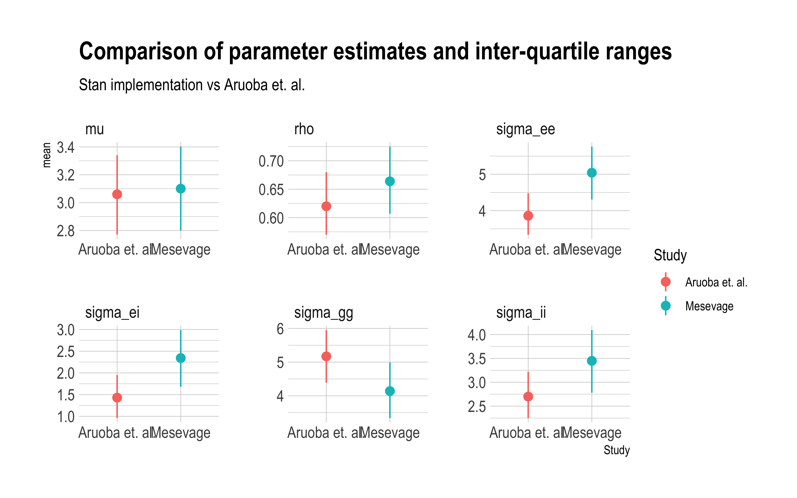
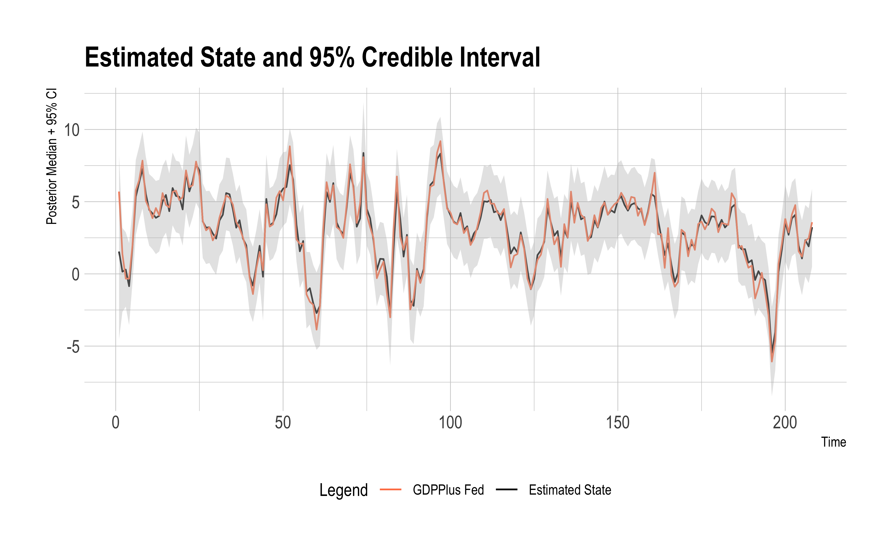

# Using Bayesian State Space Models to Reconcile Historical GDP Estimates

Since the pioneering work of Phyllis and Deane [@deaneBritishEconomicGrowth1967]
economic historians
have worked to reconstruct historical national accounts. These 
efforts have greatly expanded our knowledge of the historical 
evolution of economic activity. Recent efforts to *compare*
quantities derived from national accounts, however,
demand some greater attention to the quantification of
the uncertainty inherent in a measurement process like the 
reconstruction of GDP [@feinsteinPleaErrors2002].
The object of this exercise is to articulate the merits of a 
Bayesian state-space framework for the measurement of historical
GDP. The framework lends itself naturally to the quantification of 
uncertainly, and allows the economic historian to incorporate 
prior information where it is warranted.

The approach taken here follows that of Aruoba et. al. 
in particular [@aruobaImprovingMeasurementMeasurementerror2016],
as well as multiple examples of GDP estimation via
various versions of state-space models, in particular
Kalman filters.

Given a series of measures of GDP such as $GDP_i$, $GDP_e$, and 
$GDP_o$, for the income, expenditure, and output approaches to measuring GDP, we might like to optimally combine them to get a series $GDP_c$ that reflects the measurement efforts of multiple scholars. Many attempts to combine GDP measurements exist, and here we follow the approach of Aruoba et. al. as they designed the state-space estimator for GDPPlus as implemented by the Philadelphia Federal Reserve.

We stack our GDP measures into a vector $Y_{t}$ measured over time periods $t$ to $T$. We assume that our measurements of GDP are generated by true GDP, but are corrupted by noise:

$Y_t = [1, 1, 1]' x_t + \epsilon_t.$

True GDP itself is latent but moves autoregressively:

$x_t = \mu (1 - \rho) + \rho x_{t-1} + \eta_t.$

An important consideration is the covariance structure of our measurements of GDP. It is reasonable to think that they are likely to be correlated, thus we model the covariance of our system as block-diagonal in the signals, so that the 4 $\times$ 4 matrix $\Sigma$ has zeros in rows 2:4 of column 1, and in columns 2:4 of row 1.

$$
\Sigma = 
\begin{bmatrix}
\sigma_{gg} & 0 & 0 & 0 \\
0 & \sigma_{ii} & \sigma_{ie} & \sigma_{io} \\
0 & \sigma_{ei} & \sigma_{ee} & \sigma_{eo} \\
0 & \sigma_{oi} & \sigma_{oe} & \sigma_{oo}
\end{bmatrix}
$$

We are unfortunately constrained initially to a block-diagonal formulation 
so that the system remains identifiable. Aruoba et. al. suggest two approaches to relaxing this assumption which I will try to incorporate later.

As a result of this formulation, we need to estimate 9 parameters: $\mu$, $\rho$, the 4 diagonal variance terms $sigma_{xx} \forall x \in {g,i,e,o}$, and the off-diagonal variance terms in the lower or upper triangle of $\Sigma$.

## Replicating GDPPlus

As a first benchmarking excercise, we replicate the Bayesian dynamic state-space model
estimates of @aruobaImprovingMeasurementMeasurementerror2016 using
the Hamiltonian Monte Carlo sampler in Stan. We pick similar priors
where the parameterization is equivalent. We use a cholesky decomposition
for parameterizing the variance-covariance matrix which results in a 
different prior parameterization. Also, we put a prior on the first
observation in the series rather than setting it via estimation.
The figure below compares paramter estimates.

The estimated parameters are uniformly close in value. The estimates of 
the autoregressive coefficients $\mu$ and $\rho$ representing the
mean and autoregressive parameters respectively are particularly similar
with in both instances the posterior means differing by less than
10%.

The similarity of the estimates is more easily perceived by simply
plotting the gdp forecast from the Stan model against the 
estimates produced by the GDPPlus model -- which are published
by the Federal Reserve. The figure below shows the GDPPlus estimates
(in coral) alongside our estimates (in black), with a 95% credible
interval in grey. The lines are nearly identical. The sole deviation 
is the first observation reflecting the different approaches to 
initializing the series.

# Historical National Accounts

The Aruoba et. al. example represents a situation in which 
you have multiple attempts to measure the same thing. The
approach is to assume the measurements are generated by a 
latent true state (the thing), and that the measurements
are correct up to an unknown error with an 
unknown variance-covariance structure with the 
other measurements. The logic of this procedure can
be ported directly to other historical national accounts
where we have multiple measurements of the same latent
quantity, e.g. GDP measurements using the income or
output methods.

A more difficult problem arises when we have the measured
*components* of GDP and want to think about how to 
combine them. An example of this is the data series 
relied upon by @broadberryBritishEconomicGrowth2015 which
builds out a GDP index using as inputs an index of the
value-added components of Agriculture, Industry, and 
Services. These underlying indices are then combined
using weights, which are themselves historical estimates.
Thus
$$
GDP_t = C_tw_t
$$
where $C_t$ are the components of $GDP$ at time $t$ and $w_t$ are the
weights given to each component. In this framework, the measured 
GDP is simply the product of a formula of known quantities.

A more realistic approach to this problem, however, would recognize
that each of the components is in fact an estimate subject to error,
that these errors have an unknown covariance structure, and that the 
weights themselves are also estimates -- quite weakly measured
estimates in fact. The weights are recovered from one input output
table and estimated for a handful of benchmark years, e.g. between 
1270 and 1700 there are estimated weights only for 1381, 1522, 1600
and 1700. These weights in the GDP equation are not interpolated, but
the authors pick dates at which to switch from using one set of 
weights to another, e.g. the weights switch in 1450, 1550, and 1650.

We might represent our more realistic model for GDP by incorporating the 
uncertainty associated with the measurement process. Let us start by
stipulating that
$$
GDP_t = a_t w_a + i_t w_i + s_t w_s\\
$$
where $a_t$ is the true value of the agriculture component and
$w_a$ its true weight, and the other terms are similarly defined
for industry and services. Each component $c_t$ follows a 
state-space process
$$
c_t = \mu_c(1-\rho_c) + c_{t-1}\rho_c + \epsilon_c, \forall c \in \{a, i, s\}
$$
with the errors modeled as
$$
\begin{bmatrix}
\epsilon_a \\
\epsilon_i \\
\epsilon_s \\
\end{bmatrix}
= N\Big( 
\begin{bmatrix} 
0\\
0\\
0
\end{bmatrix},
\begin{bmatrix}
\sigma_{aa} & 0 & 0 \\
0 & \sigma_{ii} & 0 \\
0 & 0 & \sigma_{ss}
\end{bmatrix}
\Big)
$$
The errors are multivariate normally distributed with a variance-covariance
matrix $\Sigma_c$. Here we assume that the innovations to the 
*true* underlying components are independent.

Our knowledge of how the true components evolve depend upon the 
signals (measurements) we observe. We will denote measurements with
uppercase letters. Each measurement of a component is subject 
to error and these errors might be correlated, thus the system
evolves as
$$
C_t = c_t + e_C, \forall C \in \{A, I, S\} 
$$
and the errors $e_C$ are modelled as

$$
\begin{bmatrix}
e_A \\
e_I \\
e_S \\
\end{bmatrix}
= N\Big( 
\begin{bmatrix} 
0\\
0\\
0
\end{bmatrix},
\begin{bmatrix}
\sigma_{AA} & \sigma_{AI} & \sigma_{AS} \\
\sigma_{AI} & \sigma_{II} & \sigma_{IS} \\
\sigma_{AS} & \sigma_{IS} & \sigma_{SS}
\end{bmatrix}
\Big)
$$

# Works Cited

