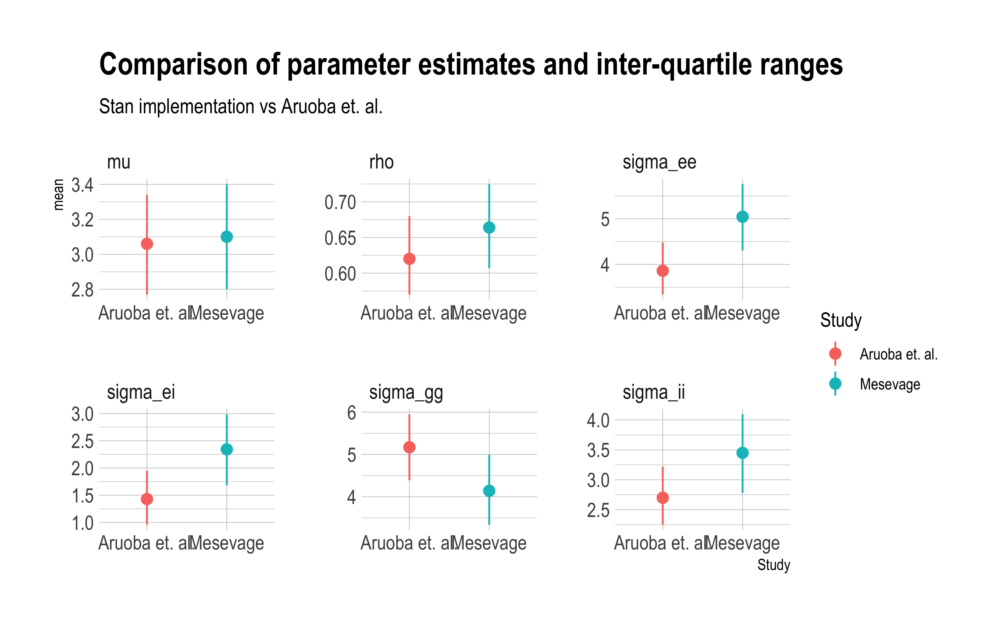
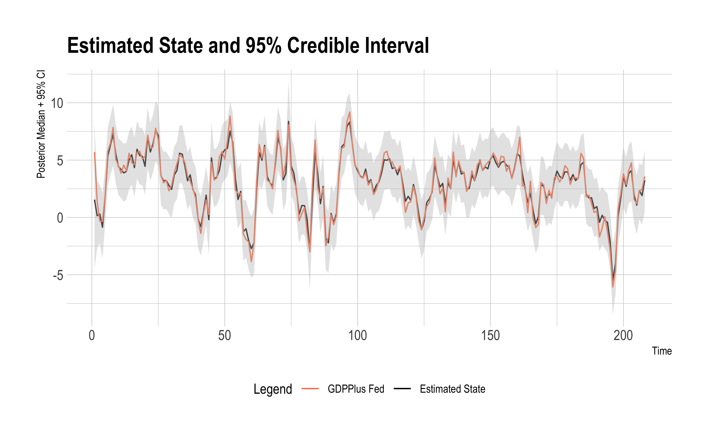

Historical National Accounts: A State Space Approach
================
Dr. Gabriel Geisler Mesevage
02/09/2021

# Using Bayesian State Space Models to Reconcile Historical GDP Estimates

Since the pioneering work of Phyllis and Deane (Deane and Cole 1967)
economic historians have worked to reconstruct historical national
accounts. These efforts have greatly expanded our knowledge of the
historical evolution of economic activity. Recent efforts to *compare*
quantities derived from national accounts, however, demand some greater
attention to the quantification of the uncertainty inherent in a
measurement process like the reconstruction of GDP (Feinstein and Thomas
2002). The object of this exercise is to articulate the merits of a
Bayesian state-space framework for the measurement of historical GDP.
The framework lends itself naturally to the quantification of
uncertainly, and allows the economic historian to incorporate prior
information where it is warranted.

The approach taken here follows that of Aruoba et. al.  in particular
(Aruoba et al. 2016), as well as multiple examples of GDP estimation via
various versions of state-space models, in particular Kalman filters.

Given a series of measures of GDP such as *G**D**P**i*,
*G**D**P**e*, and *G**D**P**o*, for the income,
expenditure, and output approaches to measuring GDP, we might like to
optimally combine them to get a series *G**D**P**c* that
reflects the measurement efforts of multiple scholars. Many attempts to
combine GDP measurements exist, and here we follow the approach of
Aruoba et. al. as they designed the state-space estimator for GDPPlus as
implemented by the Philadelphia Federal Reserve.

We stack our GDP measures into a vector *Y**t* measured over
time periods *t* to *T*. We assume that our measurements of GDP are
generated by true GDP, but are corrupted by noise:

*Y**t* = \[1, 1, 1\]′*x**t* + *ϵ**t*.

True GDP itself is latent but moves autoregressively:

*x**t* = *μ*(1 − *ρ*) + *ρ**x**t* − 1 + *η**t*.

An important consideration is the covariance structure of our
measurements of GDP. It is reasonable to think that they are likely to
be correlated, thus we model the covariance of our system as
block-diagonal in the signals, so that the 4 × 4 matrix *Σ* has zeros in
rows 2:4 of column 1, and in columns 2:4 of row 1.

$$
\\Sigma = 
\\begin{bmatrix}
\\sigma\_{gg} & 0 & 0 & 0 \\\\
0 & \\sigma\_{ii} & \\sigma\_{ie} & \\sigma\_{io} \\\\
0 & \\sigma\_{ei} & \\sigma\_{ee} & \\sigma\_{eo} \\\\
0 & \\sigma\_{oi} & \\sigma\_{oe} & \\sigma\_{oo}
\\end{bmatrix}
$$

We are unfortunately constrained initially to a block-diagonal
formulation so that the system remains identifiable. Aruoba et.
al. suggest two approaches to relaxing this assumption which I will try
to incorporate later.

As a result of this formulation, we need to estimate 9 parameters: *μ*,
*ρ*, the 4 diagonal variance terms
*s**i**g**m**a**x**x*∀*x* ∈ *g*, *i*, *e*, *o*, and the
off-diagonal variance terms in the lower or upper triangle of *Σ*.

## Replicating GDPPlus

As a first benchmarking excercise, we replicate the Bayesian dynamic
state-space model estimates of Aruoba et al. (2016) using the
Hamiltonian Monte Carlo sampler in Stan. We pick similar priors where
the parameterization is equivalent. We use a cholesky decomposition for
parameterizing the variance-covariance matrix which results in a
different prior parameterization. Also, we put a prior on the first
observation in the series rather than setting it via estimation. The
figure below compares paramter estimates.

The estimated parameters are uniformly close in value. The estimates of
the autoregressive coefficients *μ* and *ρ* representing the mean and
autoregressive parameters respectively are particularly similar with in
both instances the posterior means differing by less than 10%.

The similarity of the estimates is more easily perceived by simply
plotting the gdp forecast from the Stan model against the estimates
produced by the GDPPlus model – which are published by the Federal
Reserve. The figure below shows the GDPPlus estimates (in coral)
alongside our estimates (in black), with a 95% credible interval in
grey. The lines are nearly identical. The sole deviation is the first
observation reflecting the different approaches to initializing the
series.

# Historical National Accounts

The Aruoba et. al. example represents a situation in which you have
multiple attempts to measure the same thing. The approach is to assume
the measurements are generated by a latent true state (the thing), and
that the measurements are correct up to an unknown error with an unknown
variance-covariance structure with the other measurements. The logic of
this procedure can be ported directly to other historical national
accounts where we have multiple measurements of the same latent
quantity, e.g. GDP measurements using the income or output methods.

A more difficult problem arises when we have the measured *components*
of GDP and want to think about how to combine them. An example of this
is the data series relied upon by
(**broadberryBritishEconomicGrowth2015?**) which builds out a GDP index
using as inputs an index of the value-added components of Agriculture,
Industry, and Services. These underlying indices are then combined using
weights, which are themselves historical estimates. Thus
*G**D**P**t* = *C**t**w**t*
where *C**t* are the components of *G**D**P* at time *t* and
*w**t* are the weights given to each component. In this
framework, the measured GDP is simply the product of a formula of known
quantities.

A more realistic approach to this problem, however, would recognize that
each of the components is in fact an estimate subject to error, that
these errors have an unknown covariance structure, and that the weights
themselves are also estimates – quite weakly measured estimates in fact.
The weights are recovered from one input output table and estimated for
a handful of benchmark years, e.g. between 1270 and 1700 there are
estimated weights only for 1381, 1522, 1600 and 1700. These weights in
the GDP equation are not interpolated, but the authors pick dates at
which to switch from using one set of weights to another, e.g. the
weights switch in 1450, 1550, and 1650.

We might represent our more realistic model for GDP by incorporating the
uncertainty associated with the measurement process. Let us start by
stipulating that
$$
GDP\_t = a\_t w\_a + i\_t w\_i + s\_t w\_s\\\\
$$
where *a**t* is the true value of the agriculture component
and *w**a* its true weight, and the other terms are similarly
defined for industry and services. Each component *c**t*
follows a state-space process
*c**t* = *μ**c*(1 − *ρ**c*) + *c**t* − 1*ρ**c* + *ϵ**c*, ∀*c* ∈ {*a*, *i*, *s*}
with the errors modeled as
$$
\\begin{bmatrix}
\\epsilon\_a \\\\
\\epsilon\_i \\\\
\\epsilon\_s \\\\
\\end{bmatrix}
= N\\Big( 
\\begin{bmatrix} 
0\\\\
0\\\\
0
\\end{bmatrix},
\\begin{bmatrix}
\\sigma\_{aa} & 0 & 0 \\\\
0 & \\sigma\_{ii} & 0 \\\\
0 & 0 & \\sigma\_{ss}
\\end{bmatrix}
\\Big)
$$
The errors are multivariate normally distributed with a
variance-covariance matrix *Σ**c*. Here we assume that the
innovations to the *true* underlying components are independent.

Our knowledge of how the true components evolve depend upon the signals
(measurements) we observe. We will denote measurements with uppercase
letters. Each measurement of a component is subject to error and these
errors might be correlated, thus the system evolves as
*C**t* = *c**t* + *e**C*, ∀*C* ∈ {*A*, *I*, *S*}
and the errors *e**C* are modelled as

$$
\\begin{bmatrix}
e\_A \\\\
e\_I \\\\
e\_S \\\\
\\end{bmatrix}
= N\\Big( 
\\begin{bmatrix} 
0\\\\
0\\\\
0
\\end{bmatrix},
\\begin{bmatrix}
\\sigma\_{AA} & \\sigma\_{AI} & \\sigma\_{AS} \\\\
\\sigma\_{AI} & \\sigma\_{II} & \\sigma\_{IS} \\\\
\\sigma\_{AS} & \\sigma\_{IS} & \\sigma\_{SS}
\\end{bmatrix}
\\Big)
$$

# Works Cited

Aruoba, S. Borağan, Francis X. Diebold, Jeremy Nalewaik, Frank
Schorfheide, and Dongho Song. 2016. “Improving G D P Measurement: A
Measurement-Error Perspective.” *Journal of Econometrics* 191 (2):
384–97. <https://doi.org/10.1016/j.jeconom.2015.12.009>.

Deane, P., and W. A. Cole. 1967. *British Economic Growth, 1688-1959:
Trends and Structure*. Cambridge University Press.

Feinstein, Charles H., and Mark Thomas. 2002. “A Plea for Errors.”
*Historical Methods: A Journal of Quantitative and Interdisciplinary
History* 35 (4): 155–65. <https://doi.org/10.1080/01615440209601205>.

